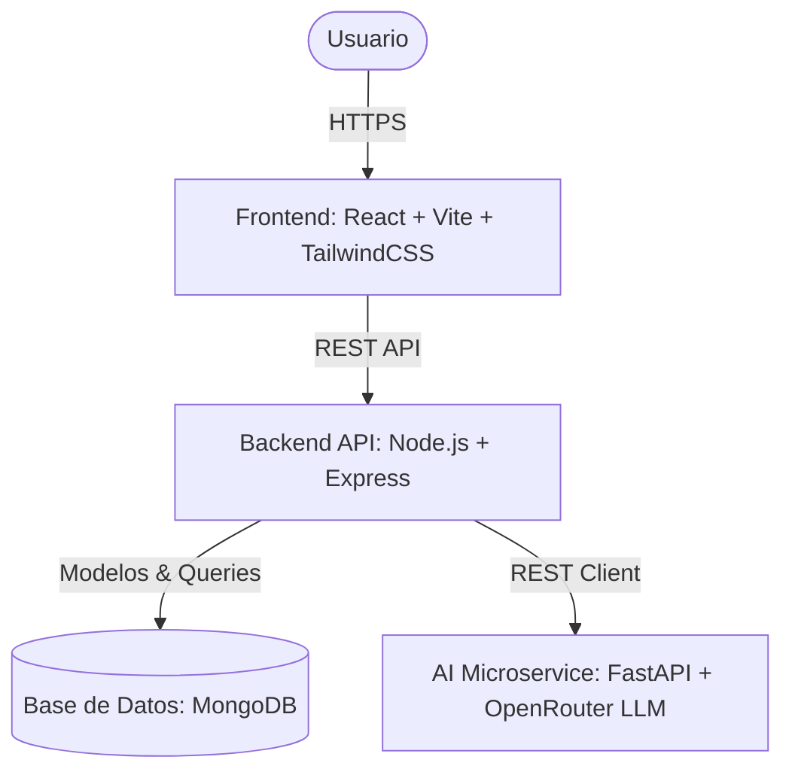

# ThesisFlow 🎓

ThesisFlow es una plataforma web MERN colaborativa diseñada para la gestión, seguimiento y estructuración de proyectos de tesis y desarrollo de software académico. Integra asistentes de Inteligencia Artificial para la extracción y recomendación de requerimientos, análisis de impacto y trade-offs de arquitectura, además de control de presencia y trazabilidad de los artefactos en tiempo real.

---

## Arquitectura del Proyecto

La aplicación se compone de tres servicios principales:



1. **Frontend (`/frontend`)**: Aplicación SPA construida con React, Vite, TypeScript y TailwindCSS. Administra el estado global mediante Zustand.
2. **Backend (`/backend`)**: API REST construida con Node.js, Express, Mongoose y TypeScript. Maneja la lógica de negocio, autenticación, trazabilidad e integridad de datos.
3. **AI Service (`/ai-service`)**: Microservicio desarrollado en Python con FastAPI. Conecta con modelos de lenguaje masivos (LLMs) a través de OpenRouter para realizar la estructuración de documentos, diagramas Mermaid y extracción de requerimientos.

---

## Características Principales

*   **Identificación por RUT Chileno**: Sistema de autenticación seguro basado en el RUT de Chile (Rol Único Tributario) con validación y formateo en tiempo real.
*   **Gestión de Requerimientos Asistida por IA**:
    *   Carga y procesamiento de minutas de reuniones.
    *   Generador de sugerencias de requerimientos funcionales y no funcionales.
    *   **Pantalla de revisión interactiva** que detalla la explicación y justificación de cada propuesta de la IA antes de guardarla.
*   **Trazabilidad de Requerimientos**: Análisis de impacto basado en un motor de grafos (BFS) que mapea de forma recursiva cómo afecta el cambio de un requerimiento a tareas, ADRs, diagramas y entregables.
*   **Evaluaciones Formales por Rúbricas**:
    *   Cálculo automático de notas ponderadas criterio por criterio.
    *   **Vincular Evidencia**: Permite adjuntar entregables específicos y minutas del proyecto a la evaluación para auditar el rendimiento.
    *   **Importador Inteligente de Rúbricas (AI OCR)**: Carga y análisis automático de pautas docentes impresas o digitales en formato PDF/texto.
*   **Hoja de Ruta Interactiva e Hitos (Gantt & CRUD)**:
    *   Planificador de hitos académicos vinculados a los entregables del backend.
    *   **Diagrama Gantt por Semanas** con línea de tiempo dinámica de seguimiento diario ("HOY").
    *   **Motor de Proyección IA**: Estimación predictiva de la fecha de finalización del proyecto calculando la velocidad de desarrollo del equipo.
*   **Sistema de Notificaciones, Correo y Digests**:
    *   Avisos integrados en la aplicación (Campana de notificaciones).
    *   Integración SMTP para envíos de correo en tiempo real.
    *   Cola de notificaciones para consolidar resúmenes diarios/semanales (Digests).
*   **Zona de Peligro (Eliminación en Cascada)**: Flujo administrativo seguro que remueve permanentemente un proyecto y toda su información distribuida en los módulos asociados de forma limpia e irreversible.
*   **Control de Presencia**: Monitoreo de usuarios activos por proyecto en tiempo real.

---

## Instalación y Configuración Local

### Prerrequisitos
*   **Node.js** (v18 o superior) y **npm**.
*   **Python** (3.9 o superior) y **pip**.
*   **MongoDB** corriendo de manera local (`mongodb://localhost:27017`) o un cluster en la nube.

---

### 1. Configurar y Ejecutar el Microservicio de IA (`/ai-service`)

1. Navega al directorio del servicio:
   ```bash
   cd ai-service
   ```
2. Crea y activa un entorno virtual de Python:
   ```bash
   python -m venv venv
   # En Windows:
   .\venv\Scripts\activate
   # En macOS/Linux:
   source venv/bin/activate
   ```
3. Instala las dependencias:
   ```bash
   pip install -r requirements.txt
   ```
4. Crea un archivo `.env` en la raíz de `ai-service`:
   ```env
   PORT=8000
   OPENROUTER_API_KEY=tu_api_key_de_openrouter
   OPENROUTER_MODEL=google/gemini-2.5-flash
   ```
5. Inicia el servidor de desarrollo:
   ```bash
   python main.py
   ```
   El servicio estará disponible en `http://localhost:8000`.

---

### 2. Configurar y Ejecutar el Backend (`/backend`)

1. Navega al directorio del backend:
   ```bash
   cd backend
   ```
2. Instala las dependencias de Node:
   ```bash
   npm install
   ```
3. Crea un archivo `.env` en la raíz de `backend`:
   ```env
   PORT=5000
   MONGO_URI=mongodb://localhost:27017/thesis-flow
   JWT_SECRET=tu_jwt_secreto_super_seguro
   AI_SERVICE_URL=http://localhost:8000

   # Configuración de Correo SMTP (Ejemplo de aplicación)
   EMAIL_USER=tu_correo@gmail.com
   EMAIL_PASS=tu_contraseña_de_aplicacion
   ```
4. Ejecuta el script de semilla (seeding) para limpiar la base de datos y poblar 15 proyectos completos de prueba con sus usuarios, hitos, ADRs y tareas correspondientes:
   ```bash
   npx ts-node src/seed.ts
   ```
5. Inicia el servidor de desarrollo:
   ```bash
   npm run dev
   ```
   El backend estará disponible en `http://localhost:5000`.

---

### 3. Configurar y Ejecutar el Frontend (`/frontend`)

1. Navega al directorio del frontend:
   ```bash
   cd frontend
   ```
2. Instala las dependencias:
   ```bash
   npm install
   ```
3. Ejecuta el servidor de desarrollo:
   ```bash
   npm run dev
   ```
   El frontend abrirá por defecto en `http://localhost:5173`.

---

## Cuentas de Prueba por Defecto

Tras ejecutar el script de seed, puedes iniciar sesión utilizando las siguientes credenciales (Contraseña común: `password123`):

| Nombre | RUT | Rol Global | Descripción |
| :--- | :--- | :--- | :--- |
| **Sebastian Vasquez** | `21.661.083-0` | `Creador` | Estudiante líder del proyecto principal |
| **Paolo Grassi** | `20.994.544-4` | `Editor` | Estudiante colaborador del equipo |
| **Benjamin Flores** | `21.450.830-3` | `Editor` | Estudiante colaborador del equipo |
| **Dra. María González** | `22.222.222-2` | `Docente` | Profesor Guía asignado a proyectos |
| **Dr. John Doe** | `33.333.333-3` | `Evaluador` | Evaluador académico externo |
| **Coordinador de Tesis** | `11.111.111-1` | `Coordinador` | Autoridad académica con acceso general |

---

## Guía de Despliegue en Producción
Para desplegar la aplicación en la nube (Vercel + Render + MongoDB Atlas), consulta nuestra detallada [Guía de Despliegue](./deployment_guide.md).
