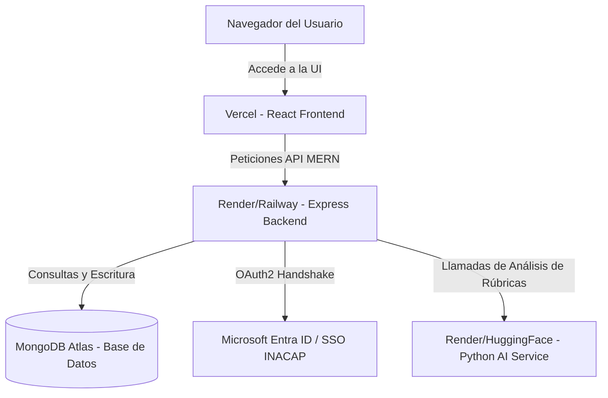

# Plan de Despliegue de ThesisFlow 🚀

Esta guía detalla la arquitectura recomendada y los pasos para desplegar el frontend, el backend y el microservicio de IA de **ThesisFlow** de forma gratuita o de muy bajo costo, ideal para defensas de título y entornos de prueba.

---

---

## 1. Base de Datos: MongoDB Atlas (Ya Desplegado)
Tu base de datos ya está alojada de forma segura en la nube en el clúster multishard de **MongoDB Atlas**. No requiere configuraciones adicionales, ya que el backend se conecta directamente mediante la URI configurada en tu `.env`.

---

## 2. Microservicio de IA (Python FastAPI / OCR)

El servicio de IA requiere un entorno con soporte de Python y herramientas de procesamiento de imágenes. 

*   **Plataforma Recomendada**: [Render](https://render.com/) o [Hugging Face Spaces](https://huggingface.co/spaces) (con Docker).
*   **Costo**: Gratis.

### Pasos para Desplegar en Render:
1. Regístrate en [Render](https://render.com/) usando tu cuenta de GitHub.
2. Haz clic en **New +** y selecciona **Web Service**.
3. Conecta tu repositorio de GitHub donde se encuentra el microservicio de IA.
4. Si tu repositorio está dividido en carpetas, define el **Root Directory** como la carpeta del servicio de IA (ejemplo: `ai-service`).
5. Configura el entorno:
    *   **Runtime**: `Python`
    *   **Build Command**: `pip install -r requirements.txt`
    *   **Start Command**: `uvicorn main:app --host 0.0.0.0 --port $PORT`
6. En la pestaña **Environment**, define las variables de entorno que requiera tu microservicio (ejemplo: claves de OCR, etc.).
7. Haz clic en **Create Web Service**. Render te entregará una URL pública (ejemplo: `https://thesisflow-ai.onrender.com`).

---

## 3. Backend (Node.js / Express MERN)

El backend MERN se encarga de procesar los datos, autenticar y comunicarse con la base de datos y el servicio de IA.

*   **Plataforma Recomendada**: [Render](https://render.com/) (Web Services) o [Railway](https://railway.app/).
*   **Costo**: Gratis (Render) o muy bajo costo por uso (Railway).

### Pasos para Desplegar en Render:
1. En tu panel de Render, haz clic en **New +** y selecciona **Web Service**.
2. Conecta tu repositorio de GitHub y selecciona la carpeta del backend.
3. Configura los parámetros de construcción:
    *   **Root Directory**: `backend`
    *   **Runtime**: `Node`
    *   **Build Command**: `npm install && npm run build` (esto compilará el código TypeScript a JavaScript en la carpeta `dist`).
    *   **Start Command**: `node dist/index.js`
4. En **Environment Variables**, agrega las variables de tu archivo `.env`:
    *   `MONGO_URI` = `mongodb+srv://...` (Tu cadena de conexión Atlas)
    *   `JWT_SECRET` = `tu_jwt_secreto`
    *   `AI_SERVICE_URL` = `https://thesisflow-ai.onrender.com` (La URL que obtuviste en el paso anterior de la IA)
    *   `MICROSOFT_CLIENT_ID` = `tu_microsoft_client_id_aqui`
    *   `MICROSOFT_CLIENT_SECRET` = `tu_microsoft_client_secret_aqui`
    *   `MICROSOFT_TENANT_ID` = `common`
    *   `MICROSOFT_REDIRECT_URI` = `https://tu-backend.onrender.com/api/auth/microsoft/callback` *(Nota: Deberás actualizar esta URL también en tu Azure Portal)*
    *   `FRONTEND_URL` = `https://tu-frontend.vercel.app` (La URL que obtendrás al desplegar el frontend)
    *   Configuraciones SMTP de correo.
5. Haz clic en **Create Web Service**. Render compilará tu aplicación y te entregará tu URL del backend (ejemplo: `https://thesisflow-backend.onrender.com`).

---

## 4. Frontend (Vite / React)

El cliente web estático se compila a HTML/JS/CSS optimizados y se distribuye a través de una red de entrega de contenido (CDN) global.

*   **Plataforma Recomendada**: [Vercel](https://vercel.com/) (el estándar de oro para React/Vite) o [Netlify](https://www.netlify.com/).
*   **Costo**: 100% Gratis.

### Pasos para Desplegar en Vercel:
1. Regístrate o inicia sesión en [Vercel](https://vercel.com/) con tu cuenta de GitHub.
2. Haz clic en **Add New** > **Project**.
3. Importa tu repositorio de ThesisFlow.
4. En la configuración del proyecto:
    *   **Framework Preset**: Selecciona `Vite` (Vercel lo detecta automáticamente).
    *   **Root Directory**: `frontend`
    *   **Build Command**: `npm run build`
    *   **Output Directory**: `dist`
5. En **Environment Variables**, agrega las variables necesarias para el frontend:
    *   `VITE_API_URL` = `https://thesisflow-backend.onrender.com/api` (La URL de tu backend desplegado en Render).
6. Haz clic en **Deploy**. ¡En menos de un minuto tu frontend estará en línea con HTTPS gratuito!

---

## 📋 Resumen de URL cruzadas para actualizar tras el despliegue:

| Plataforma | Configuración a Actualizar | Valor / URL Destino |
| :--- | :--- | :--- |
| **Azure Portal** (App Registrations) | URIs de Redirección Web | `https://tu-backend.onrender.com/api/auth/microsoft/callback` |
| **Backend** (`.env` en Render) | `FRONTEND_URL` | `https://tu-frontend.vercel.app` |
| **Frontend** (Vercel Variables) | `VITE_API_URL` | `https://tu-backend.onrender.com/api` |
